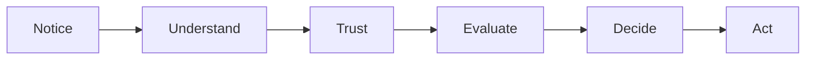

# Persuasion and Human Decision-Making

## What is persuasion?

Persuasion is the process of helping people notice, understand, trust, and act on an idea. It is not magic and it is not only about selling. It is a tool for shaping attention and making a message easier to interpret, evaluate, and respond to.

A good way to think about it is this: persuasion does not create a decision out of nothing. It helps people move from a problem, a belief, or a desire toward a clearer choice.

That is different from coercion, where force or pressure removes real choice. It is also different from manipulation, where someone hides the real purpose, uses deception, or exploits a person’s confusion or vulnerability.

A persuasive message can be honest, useful, and respectful. It can also become manipulative when it overwhelms judgment, hides important information, or plays on fear without giving a person room to think clearly.

## Why persuasion matters in design

Designers are often trying to help people decide something: whether to click, trust, buy, join, donate, learn, or remember.

Persuasion becomes part of design when a message, interface, or product shape helps someone:

- see the problem clearly
- understand the value
- feel confidence in the option
- imagine the next action

That is why persuasion and design are connected. A product can be useful, but if the story, layout, or context do not explain value well, attention and trust can drift away.

## Robert Cialdini's major principles

Psychologist Robert Cialdini identified several recurring patterns in how people respond to influence. These are useful ideas, but they are not magic rules. They are patterns that become more ethical or more risky depending on how they are used.

| Principle | Mechanism | Ethical use | Misuse risk |
| --- | --- | --- | --- |
| Reciprocity | People feel obliged to return a favor or gift | Offer useful information, samples, or genuine help | Overwhelm people with pressure or guilt |
| Scarcity | People value things more when they seem limited | Highlight real constraints, availability, or urgency | Create artificial urgency or fear |
| Authority | People trust credible experts or institutions | Show expertise, experience, and honest evidence | Pretend expertise or use fake credibility |
| Consistency | People like to act in ways that match their values or prior choices | Ask for commitments that fit the person’s goals | Trap people into decisions they do not truly want |
| Liking | People respond more positively to those they know, like, or trust | Build trust through clarity, respect, and alignment | Use flattery or fake rapport |
| Social proof | People look to others to decide what is normal or good | Share real examples, testimonials, and evidence | Fake popularity or exploit group pressure |

## Additional ideas from psychology and communication

Persuasion is broader than a list of six principles. Other useful ideas help explain how attention, trust, and action are shaped.

### Loss aversion

People usually feel the pain of a loss more strongly than the pleasure of a comparable gain. This is why a message framed as “don’t miss out” can be more compelling than “you will gain.”

### Framing

The same information can feel different depending on how it is presented. For example, “90% success” sounds more positive than “10% failure,” even though both describe the same underlying reality. Framing affects interpretation before a person even decides.

### Ethos, pathos, and logos

Classical rhetoric gives a useful lens:

- Ethos: credibility and trust
- Pathos: emotion and connection
- Logos: logic and evidence

A strong message often balances all three. A product claim that relies only on emotion without evidence may feel hollow. A message that is only logical may fail to create human connection.

### Attention is limited

People do not process every detail equally. Good persuasion respects the reality that attention is scarce. That means clarity matters more than cleverness. A message that is too dense or noisy often fails before it even reaches a decision point.

## A simple decision journey

This simple path reminds us that persuasion is not just about the final click. It involves attention, interpretation, trust, and then action.

## Questions to Ask Before Trying to Persuade

Before asking someone to act, a designer should pause and ask:

- What problem am I actually helping them solve?
- What information am I leaving out, or what assumptions am I building on?
- Am I asking for a decision that fits their values, or am I creating pressure?
- Am I using evidence, or am I relying on fear or shallow emotion?
- Is the message clear enough that a person could still say no?
- What would a skeptical person notice immediately?

If a message cannot survive honest scrutiny, it is likely weak, not persuasive.

## White T-shirt example

Imagine the same plain white T-shirt shown in two ways.

One version is presented as a basic work shirt: “Comfortable cotton. Everyday essential. Simple and reliable.”

Another version is presented with a story of identity, craft, and intention: “A clean canvas for your routines, your creativity, and your own way of showing up.”

The shirt is the same physical object. The difference is how it is framed: as utility, as self-expression, as status, or as a simple ritual object.

A persuasive designer is not creating a different shirt. They are changing how the audience sees the same product and what meaning they are invited to attach to it.

## What You Should Remember

- Persuasion helps people notice, interpret, trust, and act.
- It is not the same as coercion or manipulation.
- Cialdini’s principles are useful frameworks, not a guarantee of ethical behavior.
- Attention, framing, trust, and clarity matter as much as the final ask.
- Good persuasion respects the other person’s ability to think and choose.
- A plain white T-shirt becomes different products when the story changes, even if the fabric does not.

## Explore Further

If you want to look deeper, search for:

- Cialdini influence principles explained simply
- behavioral economics framing examples
- ethical persuasion vs manipulation
- rhetoric ethos pathos logos
- decision-making psychology for design
